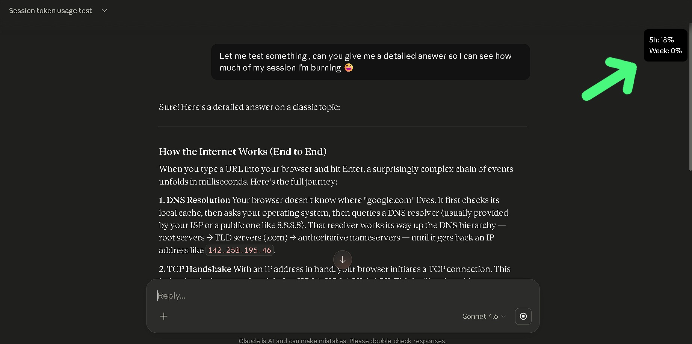

# Claude Usage Counter Chrome Extension

A lightweight Chrome extension that displays your Claude session usage (5-hour and weekly limits) directly inside the Claude interface.
##  Why this exists

When using Claude, it's easy to waste usage on low-value prompts without realizing how much quota is left.

This extension helps you:

* Track session usage in real time
* Avoid wasting tokens on unnecessary prompts
* Make smarter, more efficient queries
<p align="center">
  
</p>

---

##  Features

* Real-time usage tracking
* Displays 5-hour and weekly utilization
* Auto-updates every  seconds
* Minimal UI, non-intrusive

---

##  Download & Setup

###  Direct Download (Recommended)

Download ZIP directly:

```
https://github.com/Brahmagithubrit/claude-usage-counter-/archive/refs/heads/main.zip
```

 Just download → extract → follow setup below

---

### Step 1 : Download the extension (Manual way)

1. Go to this repository
2. Click **Code → Download ZIP**
3. Extract the ZIP file

---

### Step 2 : Load extension in Chrome

1. Open Chrome
2. Go to:

   ```
   chrome://extensions/
   ```
3. Enable **Developer Mode** (top right)
4. Click **Load unpacked**
5. Select the extracted folder

---

### Step 3 : Use it

1. Open Claude: [https://claude.ai](https://claude.ai)
2. Send any message
3. You will see a usage box at the top-right

---


---

##  Notes

* Works only on `https://claude.ai`
* Requires an active Claude session (logged in)
* UI updates every few seconds

---

##  Future Improvements

* Progress bars (visual usage)
* Reset timers display
* Better UI integration
* Settings panel

---

##  Contributing

Feel free to fork and improve the project.

---

##  License

MIT License
